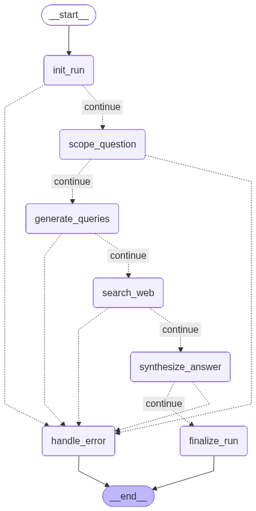

# 🔍 Focused Research Agent

> An AI-powered research assistant that plans, searches, and synthesizes — so you get sourced answers, not hallucinations.

[](https://www.python.org/downloads/)
[](https://langchain-ai.github.io/langgraph/)
[](https://python.langchain.com)
[](https://fastapi.tiangolo.com)
[](https://streamlit.io)
[](https://www.sqlalchemy.org)
[](https://console.groq.com)
[](https://tavily.com)
[](https://ollama.com)
[](https://docs.astral.sh/uv/)
[](https://tushark2111-focused-research-agent.hf.space)

## 🚀 Live Demo

**[Try it here → https://tushark2111-focused-research-agent.hf.space](https://tushark2111-focused-research-agent.hf.space)**

No installation required. Ask a research question and watch the agent work.

---

## 🎯 What This Does

Most LLM apps just wrap a prompt. This one builds a full research pipeline.

Given any question, the agent:

```
Your Question
    ↓
Scope Clarification     — LLM interprets your question with context
    ↓
Query Planning          — LLM generates 3-6 targeted search queries
    ↓
Web Search              — Tavily fetches live sources + images
    ↓
Source Ranking          — Domain trust heuristic ranks results
    ↓
Answer Synthesis        — LLM synthesizes a cited, sourced answer
    ↓
Structured Result       — Answer + citations + sources + images
```

Three modes available:

| Mode | What it does |
|---|---|
| **Quick Research** | Concise answer with 1-3 citations in ~15 seconds |
| **Conversational Chat** | Multi-turn research with conversation memory |
| **Full Report** | Structured 4-section report with deeper search and images |

---

## 🏗️ Architecture

Six layers, each with one responsibility:

```
┌─────────────────────────────────────────────────┐
│  UI Layer (Streamlit)                           │
│  Home · Research · Chat · Report                │
│  Thin client — calls FastAPI over HTTP only     │
└─────────────────────┬───────────────────────────┘
                      │ HTTP
┌─────────────────────▼───────────────────────────┐
│  API Layer (FastAPI)                            │
│  Versioned routing · Dependency injection       │
│  Centralized exception handling                 │
└─────────────────────┬───────────────────────────┘
                      │ Function call
┌─────────────────────▼───────────────────────────┐
│  Application Layer                              │
│  Research · Chat · Report use cases             │
│  Input validation · State normalization         │
└─────────────────────┬───────────────────────────┘
                      │ Graph invocation
┌─────────────────────▼───────────────────────────┐
│  Graph Layer (LangGraph)                        │
│  init_run → scope → queries → search            │
│  → synthesize → finalize · handle_error         │
└─────────────────────┬───────────────────────────┘
                      │
        ┌─────────────┴─────────────┐
        ▼                           ▼
  LLM Provider                Search Provider
  (Groq · Ollama)              (Tavily)
        │                           │
        └─────────────┬─────────────┘
                      ▼
┌─────────────────────────────────────────────────┐
│  Database Layer (SQLite / PostgreSQL)           │
│  Repository Pattern · Conversation history     │
│  Report history · Image persistence            │
└─────────────────────────────────────────────────┘
```

Each layer knows only about the layer immediately below it. The LangGraph nodes know nothing about HTTP. The FastAPI routers know nothing about LangGraph. The Streamlit UI knows nothing about the graph.

---

## 🧠 LangGraph Workflow

The research pipeline is a directed graph with explicit state and conditional error routing.



### Nodes

| Node | What it does |
|---|---|
| `init_run` | Generates a unique run ID, validates question present |
| `scope_question` | LLM produces scope, assumptions, and constraints |
| `generate_queries` | LLM produces 3-6 targeted search queries |
| `search_web` | Tavily executes all queries, deduplicates sources, collects images |
| `synthesize_answer` | Ranks sources by domain trust, LLM synthesizes answer with citations |
| `finalize_run` | Marks run as `completed` or `error` |
| `handle_error` | Terminal error node — logs all errors, sets status to `error` |

### Error Routing

Every node is followed by a conditional edge that checks `state["errors"]`. If errors exist → route to `handle_error`. If not → continue.

Nodes **never raise exceptions**. They record errors in state and return. The graph always terminates cleanly at `__end__`.

---

## 🛠️ Tech Stack

| Technology | Role | Why |
|---|---|---|
| **LangGraph** | Workflow orchestration | Deterministic, reproducible graph with explicit state |
| **FastAPI** | REST API backend | Modern Python with built-in validation and DI |
| **Pydantic** | Request/response validation | Shared validation between API and application layers |
| **Groq + Llama** | LLM provider | Fast inference, generous free tier |
| **Ollama** | Alternative LLM provider | Local or cloud, no API key required |
| **Tavily** | Web search | Purpose-built for AI agents, returns structured results + images |
| **SQLAlchemy** | ORM | One-line switch from SQLite to PostgreSQL |
| **Streamlit** | Web UI | Rapid AI application development |
| **httpx** | HTTP client | Modern Python HTTP client |
| **uv** | Package management | Fast, modern Python package manager |
| **pytest** | Testing | 175 tests across multiple strategies |
| **Ruff** | Linting and formatting | Fast, modern Python linter |
| **SonarCloud** | Code quality gate | Continuous coverage and quality inspection |

---

## 📁 Project Structure

```
focused-research-agent/
├── src/
│   └── focused_research_agent/
│       ├── api/                            # FastAPI transport layer
│       │   ├── routers/
│       │   │   ├── health.py               # GET /health
│       │   │   ├── research.py             # POST /api/v1/research
│       │   │   ├── chat.py                 # POST /api/v1/chat
│       │   │   ├── report.py               # POST /api/v1/report
│       │   │   ├── conversations.py        # GET /api/v1/conversations + /reports
│       │   │   └── v1.py                   # Versioned router grouping
│       │   ├── schemas/                    # Pydantic request/response models
│       │   ├── api_exception_handlers.py   # Centralized 400/500 handling
│       │   ├── app.py                      # FastAPI app factory
│       │   └── dependencies.py             # Dependency injection wiring
│       ├── application/                    # Use-case / business logic layer
│       │   ├── exceptions.py               # ApplicationError
│       │   ├── question_validation.py      # Shared validation (API + app layer)
│       │   ├── research_use_case.py        # Single-turn research
│       │   ├── chat_use_case.py            # Multi-turn conversation
│       │   └── report_use_case.py          # Deep research report
│       ├── config/                         # Configuration layer
│       ├── database/                       # Database layer
│       │   ├── models.py                   # ConversationRun SQLAlchemy model
│       │   ├── database.py                 # Engine and session factory
│       │   └── repository.py               # Repository Pattern — only file touching SQLAlchemy
│       ├── interfaces/                     # Abstract provider contracts
│       │   ├── llm_interface.py            # LLMProvider ABC
│       │   └── search_interface.py         # SearchProvider ABC + SearchResult
│       ├── nodes/                          # LangGraph node functions
│       │   ├── init_run.py
│       │   ├── scope_question.py
│       │   ├── generate_queries.py
│       │   ├── search_web.py
│       │   ├── synthesize_answer.py
│       │   ├── finalize_run.py
│       │   └── handle_error.py
│       ├── services/                       # External provider implementations
│       │   ├── llm_factory.py
│       │   ├── llm_provider_groq.py
│       │   ├── llm_provider_ollama.py
│       │   ├── search_factory.py
│       │   └── search_provider_tavily.py
│       ├── ui/                             # Streamlit UI
│       │   ├── Home.py
│       │   ├── api_client.py               # HTTP client (no Streamlit code)
│       │   ├── views.py                    # Rendering functions (no HTTP code)
│       │   └── pages/
│       │       ├── 1_🔍_Research.py
│       │       ├── 2_💬_Chat.py
│       │       └── 3_📄_Report.py
│       ├── cli.py
│       ├── graph.py                        # LangGraph graph builder
│       └── state.py                        # ResearchState TypedDict
├── tests/                                  # 175 tests
├── docs/
├── .env.example
├── pyproject.toml
└── README.md
```

---

## ⚙️ Setup and Installation

### Prerequisites

- Python 3.13
- [uv](https://docs.astral.sh/uv/) package manager
- Groq API key — [console.groq.com](https://console.groq.com) (free tier)
- Tavily API key — [tavily.com](https://tavily.com) (free tier)

### 1. Clone the repository

```bash
git clone https://github.com/tusharkhoche/focused-research-agent.git
cd focused-research-agent
```

### 2. Install dependencies

```bash
uv sync
```

### 3. Configure environment variables

```bash
cp .env.example .env
```

Edit `.env` with your API keys:

```env
# LLM Configuration — Groq (recommended)
LLM_PROVIDER=groq
LLM_MODEL=llama-3.3-70b-versatile
LLM_API_KEY=your_groq_api_key_here
LLM_TEMPERATURE=0.0
LLM_MAX_RETRIES=2
LLM_MAX_TOKENS=2048

# Ollama cloud alternative (comment above, uncomment below)
# LLM_PROVIDER=ollama
# LLM_MODEL=gpt-oss:20b-cloud
# LLM_API_KEY=your_ollama_api_key_here

# Ollama Local alternative (no API key)
#LLM_PROVIDER=ollama
#LLM_MODEL=llama3.2:3b
#LLM_API_KEY=not-needed

# Search Configuration
SEARCH_PROVIDER=tavily
SEARCH_API_KEY=your_tavily_api_key_here
SEARCH_MAX_RESULTS=5
SEARCH_DEPTH=basic

# API Configuration
API_TITLE=Focused Research Agent API
API_VERSION=1.0.0
API_DEBUG=false

# UI Configuration
UI_API_BASE_URL=http://localhost:8000
UI_REQUEST_TIMEOUT=120

# Database
DATABASE_URL=sqlite:///./research_agent.db
```

---

## 🚀 Running the Project

### Option 1 — CLI

```bash
uv run focused-research-agent "What are the latest advances in quantum computing?"
```

### Option 2 — FastAPI only

```bash
uv run uvicorn --factory focused_research_agent.api.app:create_app --reload
```

API docs at `http://localhost:8000/docs`

### Option 3 — Full stack (recommended)

```bash
# Terminal 1 — backend
uv run uvicorn --factory focused_research_agent.api.app:create_app --reload

# Terminal 2 — UI
uv run streamlit run src/focused_research_agent/ui/Home.py
```

UI at `http://localhost:8501`

---

## 🧪 Testing

```bash
# Run all 175 tests
uv run pytest -v

# With coverage report
uv run pytest --cov=src/focused_research_agent --cov-report=term-missing -v
```

### Test strategy

| Test file | Strategy |
|---|---|
| `test_nodes_unit.py` | Each node isolated with fake providers |
| `test_nodes_smoke.py` | Full graph end-to-end with fake providers |
| `test_graph_error_paths.py` | Conditional routing with empty question |
| `test_providers_unit.py` | Groq, Ollama, Tavily with fake SDK clients |
| `test_api_*.py` | FastAPI TestClient + dependency_overrides |
| `test_database_repository.py` | In-memory SQLite |
| `test_*_use_case.py` | Fake graph + in-memory SQLite |
| `test_ui_api_client.py` | Fake httpx module |

---

## 📊 API Reference

### Endpoints

```
GET  /health
POST /api/v1/research
POST /api/v1/chat
POST /api/v1/report
GET  /api/v1/conversations
GET  /api/v1/conversations/{id}
GET  /api/v1/reports
```

### Response shape

```json
{
  "run_id": "uuid",
  "question": "string",
  "status": "completed | error",
  "scope": "string | null",
  "queries": ["string"] | null,
  "sources": [{"title": "...", "url": "...", "snippet": "...", "score": 0.95}] | null,
  "answer": "string | null",
  "citations": ["url"] | null,
  "images": ["url"] | null,
  "errors": ["string"]
}
```

### Error shape

```json
{
  "status_code": 400,
  "error": "application_error",
  "detail": "Human readable message",
  "path": "/api/v1/research"
}
```

---

## 🎨 Key Design Decisions

**Function-based nodes, class-based providers**
Nodes are pure stateless transformations. Providers hold client state. The distinction is applied consistently across the entire codebase.

**State-based error routing**
Nodes record errors in `state["errors"]` — never raise exceptions. The graph always terminates cleanly. Error paths are visible in the graph diagram.

**Provider abstraction**
Swapping LLM providers requires one environment variable change and zero application code changes. Proven by switching between Groq and Ollama during development.

**Repository Pattern**
Only `repository.py` touches SQLAlchemy. Switching from SQLite to PostgreSQL is one line in `.env`.

**Shared validation**
`validate_and_clean_question` runs in both Pydantic schemas and application layer use cases. One function, consistent behaviour at every boundary.

---

## 📈 Code Quality

| Metric             | Value |
|--------------------|---|
| Tests              | **175 passing** |
| Sonar Quality Gate | [](https://sonarcloud.io/summary/new_code?id=tusharkhoche_focused-research-agent) |
| Code duplications  | [](https://sonarcloud.io/summary/new_code?id=tusharkhoche_focused-research-agent) |
| Maintainability    | [](https://sonarcloud.io/summary/new_code?id=tusharkhoche_focused-research-agent) |
| Bugs               | [](https://sonarcloud.io/summary/new_code?id=tusharkhoche_focused-research-agent) |
| Reliability        | [](https://sonarcloud.io/summary/new_code?id=tusharkhoche_focused-research-agent)|

---

## 🏭 Production Grade — Honest Assessment (v2)

This section previously listed six categories of gaps. Every item below
has since been implemented — see the file paths for where.

### Security ✅ (was ❌)
- **Authentication** — JWT bearer tokens on every research/chat/report/
  conversations endpoint. `focused_research_agent/auth/`
- **Rate limiting** — per-endpoint limits (tighter on quota-consuming
  routes), Redis-backed for multi-instance correctness.
  `focused_research_agent/core/rate_limiter.py`
- **HTTPS enforcement** — optional `HTTPSRedirectMiddleware`, off by
  default (breaks local dev), on via `FORCE_HTTPS=true` behind a real
  reverse proxy in production.
- **Secrets manager** — pluggable `SecretsProvider` abstraction (env /
  AWS Secrets Manager / Azure Key Vault), same Factory pattern as the
  LLM/search providers. `focused_research_agent/core/secrets.py`

### Scalability ✅ (was ⚠️)
- **PostgreSQL** — one env var change, now with real Alembic migrations
  instead of bare `metadata.create_all`. `alembic/`
- **Async endpoints** — full async conversion: async SQLAlchemy, async
  LLM/search provider clients (verified `AsyncTavilyClient`,
  `ollama.AsyncClient`, and LangChain's native `.ainvoke()` all exist and
  work before committing to this design), `graph.ainvoke()` throughout.
- **Task queue** — Celery + Redis for report generation specifically
  (the slowest workflow): `POST /report/submit` + `GET /report/jobs/{id}`.
  `focused_research_agent/tasks/`
- **Caching** — repeated identical research questions hit cache instead
  of Groq/Tavily again. Redis-backed, in-memory fallback.
  `focused_research_agent/caching/`

### Monitoring ✅ (was ⚠️)
- **Distributed tracing** — OpenTelemetry, OTLP export when configured.
  `focused_research_agent/core/tracing.py`
- **Metrics dashboard** — Prometheus `/metrics` + provisioned Grafana
  dashboard. `prometheus/`, `grafana/`
- **Alerting** — Prometheus alert rules (error rate, circuit breaker
  trips, slow runs) + Alertmanager. `prometheus/alert_rules.yml`,
  `alertmanager/`
- **Structured logging** — also fixed a real bug found during this pass:
  the root logger was hardcoded to `ERROR`, silently dropping nearly
  every `INFO`/`DEBUG`/`WARNING` call in the original codebase despite
  being full of them. Now `LOG_LEVEL`-driven, JSON-formattable, with
  automatic `run_id` correlation via contextvar.

### Reliability ✅ (was ⚠️)
- **Retry logic** — tenacity exponential backoff on every provider call
  (Groq, Ollama, Tavily).
- **Circuit breaker** — per-provider, protects against cascading slow
  failures during an outage. `focused_research_agent/reliability/`
- **Graceful shutdown** — lifespan tracks in-flight requests and waits
  (bounded grace period) before the process exits.

### Bonus, beyond the original list
- **Reflection loop** — directly implements the project's own roadmap
  item: thin initial search results trigger one bounded re-search with
  refined queries. `nodes/reflect_and_refine.py`
- **Concurrent search** — Tavily queries now run via `asyncio.gather`
  instead of sequentially.
- **Per-user data isolation** — conversations/reports are now scoped to
  the authenticated user (`user_id` on `ConversationRun`), not globally
  readable by anyone with a token.

### Known debt — being honest about what this pass didn't finish
- The original 175-test suite is written against the synchronous version
  of this codebase and fails wholesale against the async conversion (sync
  test functions calling now-async code without `await`). This is
  mechanical, not a correctness problem in the app — confirmed separately
  via live end-to-end testing (see `docs/verification.md`) — but updating
  all 175 tests to `async def` + `await` + `AsyncMock` was not completed
  in this pass. 18 new tests were added and pass, covering the new auth,
  circuit breaker, and cache modules. Updating the remaining suite is the
  single highest-value follow-up.

## 🗺️ Roadmap

- [x] Phase 1 — Core LangGraph workflow + FastAPI backend
- [x] Phase 2 — Streamlit UI + UX polish
- [x] Phase 3 — Conversational research with SQLite persistence
- [x] Phase 4 — Full structured report generation mode
- [x] Phase 5 — Image rendering from Tavily search results

**Potential next steps:**
- Async FastAPI endpoints for non-blocking long runs
- PostgreSQL for multi-user production deployment
- Task queue (Celery + Redis) for report generation
- Authentication middleware
- Rate limiting
- Reflection loop — agent re-searches if initial results are insufficient

---

## 🔌 Switching LLM Providers

```bash
# Groq (fast, free tier)
LLM_PROVIDER=groq
LLM_MODEL=llama-3.3-70b-versatile

# Ollama Cloud
LLM_PROVIDER=ollama
LLM_MODEL=gpt-oss:20b-cloud

# Ollama Local (no API key)
LLM_PROVIDER=ollama
LLM_MODEL=llama3.2:3b
LLM_API_KEY=not-needed
```

Zero application code changes. The provider abstraction handles everything.

---

## 👤 Author

**Tushar Khoche**

AI/ML Developer with a background in software engineering and test automation. Built this project to demonstrate production-grade AI system design — clean architecture, provider abstraction, state-based error routing, and comprehensive test coverage across a 6-layer LangGraph + FastAPI + Streamlit stack.

[LinkedIn](https://linkedin.com/in/tusharkhoche) · [GitHub](https://github.com/tusharkhoche)

---

## 📄 License

MIT License — see [LICENSE](LICENSE) for details.